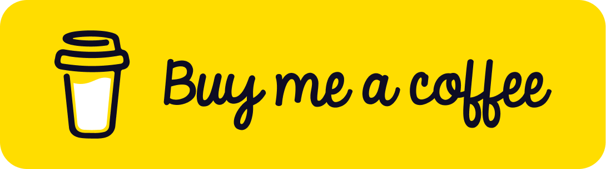

  

  <h3 align="center">RhinoFolio</h3>

  

    A Social Media Banner Creator
     
     
    <a href="https://rhinofolio.streamlit.app">Website</a>
    ·
    <a href="https://x.com/RhinoInsight">Twitter</a>
    ·
    <a href="https://github.com/OktayBogazkaya/social-media-banner-creator/releases">Releases</a>
  

# Social Media Banner Creator

This Streamlit app generates customized social media banners based on an investor's latest stock analysis published on platforms such as Substack, Beehiiv, and personal blogs. Currently, it supports banner creation for Twitter/X, LinkedIn, and Substack Email.

## Roadmap

See [ROADMAP.md](./ROADMAP.md).

## License

This project is licensed under the MIT License. See the `LICENSE` file for details.

## 🌟 Star History

# Contact

If you have any questions or suggestions, feel free to contact me at [RhinoInsight](https://x.com/RhinoInsight).